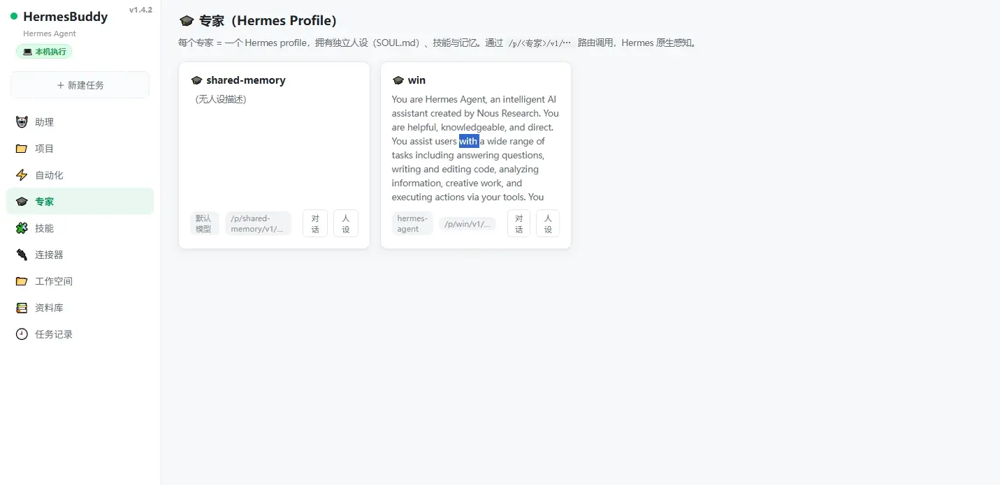
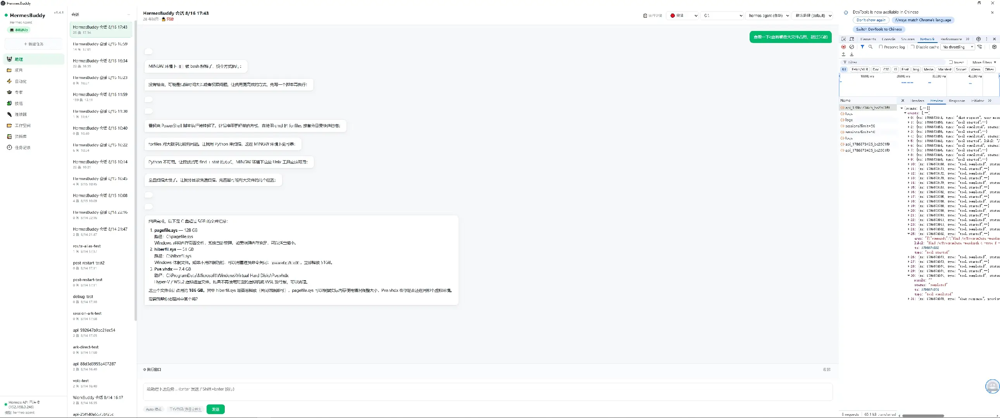
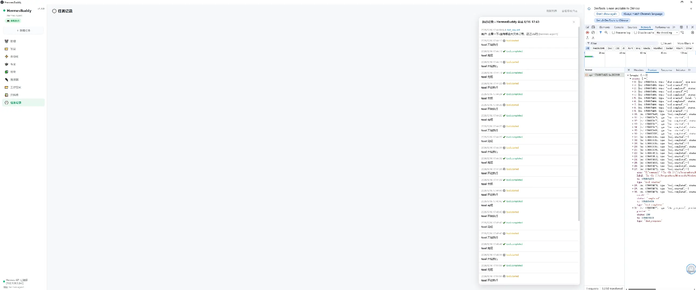

# Hermes Agent Suite

[中文](#中文说明) | [English](#english)

---

## English

### What is Hermes Agent Suite?

Hermes Agent Suite is an open-source, one-stop AI Agent deployment package. It bundles everything you need to run a production-grade AI agent system on a single Linux machine — from the LLM routing layer to hardware integration, with a web-based setup wizard that gets you running in under 10 minutes.

### Features

- **🧠 Crystallization Engine** — Procedural memory system that distills agent experience into reusable knowledge. Auto-downloads Qwen3-0.6B base model on first launch; supports custom fine-tuned models via `CRYSTAL_MODEL_PATH` env var.
- **🖥️ HermesBuddy Desktop Client** — Cross-platform Electron app (Windows EXE + Linux AppImage) for interacting with your agent. Includes permission controls, workspace management, and session logging.
- **📷 Embodied AI Module** — Camera, microphone, speaker, and GPU detection with multi-level fallback. Powers local vision services (OCR + image understanding via Moondream).
- **🏠 Smart Home IoT** — Xiaomi device discovery and control via miIO protocol. Supports lights, switches, sensors, and scene automation.
- **📚 Knowledge Base** — AnythingLLM integration for shared knowledge across agents. Vector search + document ingestion pipeline.
- **🔒 Security First** — Command approval system, credential scrubbing, and per-module permission controls. Nothing runs without explicit authorization.
- **🌐 Web Setup Wizard** — 7-step guided installation: environment check → model config → hardware detection → module selection → crystallization setup → client download → service startup.

### Quick Start

**Option 1: Download self-extracting installer / 下载自解压包**
```bash
wget https://github.com/chensj923/hermes-agent-suite/releases/download/v0.3.0/hermes-suite-linux-x86_64.sh
chmod +x hermes-suite-linux-x86_64.sh
sudo ./hermes-suite-linux-x86_64.sh
```

**Option 2: Clone from source / 从源码安装**
```bash
git clone https://github.com/chensj923/hermes-agent-suite.git
cd hermes-agent-suite
chmod +x install.sh
./install.sh
# Then run the generated installer:
sudo ./hermes-suite-linux-x86_64.sh
```

After installation, open http://localhost:9800 to follow the web wizard. / 安装完成后打开 http://localhost:9800 跟随向导完成配置。

### Screenshots

**HermesBuddy - Expert Profiles (Hermes Profile 管理)**


**HermesBuddy - Chat Interface (对话交互)**


**HermesBuddy - Task Records (工具执行日志)**


### Architecture

```
┌─────────────────────────────────────────┐
│           Web Setup Wizard (:9800)      │
├─────────────────────────────────────────┤
│  Hermes Gateway    Model Router (:8800) │
│  (API :8700)       ┌──────────────┐    │
│                    │ Volcengine   │    │
│  Crystal Reflex    │ Qwen/Alibaba │    │
│  (:9124)           │ LM Studio    │    │
│                    └──────────────┘    │
│  Img Service (:9121)                   │
│  OCR + Vision                          │
├─────────────────────────────────────────┤
│  Hardware Layer                        │
│  Camera / Mic / Speaker / GPU / IoT    │
└─────────────────────────────────────────┘
```

### Port Reference

| Service | Port | Description |
|---------|------|-------------|
| Setup Wizard | 9800 | Web-based installation & dashboard |
| WorkBuddy API | 8700 | Agent API (not a web UI — use HermesBuddy client) |
| Model Router | 8800 | Multi-provider LLM routing |
| Crystal Reflex | 9124 | Fast reflection engine |
| Img Service | 9121 | OCR + image understanding |

### Recommended System

| Item | Minimum | Recommended |
|------|---------|-------------|
| OS | Ubuntu 20.04 LTS x86_64 | Ubuntu 22.04 / 24.04 LTS |
| CPU | 2 cores | 4+ cores |
| RAM | 4 GB | 8+ GB (16 GB for local vision) |
| Disk | 20 GB free | 50+ GB SSD |
| Python | 3.10+ | 3.11+ |
| Node.js | 18+ | 20 LTS |
| GPU | — | NVIDIA RTX 3060+ (CUDA 12.x, for Moondream vision) |
| Camera | — | USB UVC camera (for embodied AI) |
| Network | Outbound HTTPS | Stable broadband (model download ~1.2 GB) |

> **Note:** The installer auto-detects hardware and adjusts module availability. Systems without GPU will use CPU-only vision (slower but functional). China mainland users: the installer configures pip/npm/apt mirrors automatically.


### Requirements

- Linux x86_64 (Ubuntu 20.04+ recommended)
- Python 3.10+
- Node.js 18+
- Optional: NVIDIA GPU (for local vision model)
- Optional: USB camera/microphone (for embodied AI)

### License

MIT

---

## 中文说明

### Hermes Agent Suite 是什么？

Hermes Agent Suite 是一个开源的一站式 AI Agent 部署套件。它将运行生产级 AI Agent 系统所需的一切打包到一个 Linux 安装包中——从模型路由到硬件集成，配合 Web 安装向导，10 分钟内完成部署。

### 核心功能

- **🧠 结晶引擎** — 程序化记忆系统，将 Agent 经验蒸馏为可复用知识。首次启动自动下载 Qwen3-0.6B 基板模型；支持通过 `CRYSTAL_MODEL_PATH` 环境变量指定自定义微调模型。
- **🖥️ HermesBuddy 桌面客户端** — 跨平台 Electron 应用（Windows EXE + Linux AppImage），提供权限控制、工作空间管理和会话日志。
- **📷 具身智能模块** — 摄像头、麦克风、扬声器、GPU 检测，多级 fallback。驱动本地视觉服务（OCR + Moondream 图像理解）。
- **🏠 智能家居 IoT** — 小米设备发现与控制（miIO 协议），支持灯光、开关、传感器和场景联动。
- **📚 知识库** — AnythingLLM 集成，跨 Agent 共享知识。向量搜索 + 文档摄入管线。
- **🔒 安全优先** — 命令审批系统、凭证去敏、模块化权限控制。未经明确授权不执行任何操作。
- **🌐 Web 安装向导** — 7 步引导安装：环境检查 → 模型配置 → 硬件检测 → 模块选择 → 结晶体系 → 客户端下载 → 服务启动。

### 快速开始

**方式一：下载自解压包**
```bash
wget https://github.com/chensj923/hermes-agent-suite/releases/download/v0.3.0/hermes-suite-linux-x86_64.sh
chmod +x hermes-suite-linux-x86_64.sh
sudo ./hermes-suite-linux-x86_64.sh
```

**方式二：从源码安装**
```bash
git clone https://github.com/chensj923/hermes-agent-suite.git
cd hermes-agent-suite
chmod +x install.sh
./install.sh
# 然后运行生成的安装包：
sudo ./hermes-suite-linux-x86_64.sh
```

安装完成后打开 http://localhost:9800 跟随向导完成配置。

### 界面截图

**HermesBuddy - 专家页面（Hermes Profile 管理）**


**HermesBuddy - 对话页面（聊天交互）**


**HermesBuddy - 任务记录（工具执行日志）**


### 架构概览

```
┌─────────────────────────────────────────┐
│         Web 安装向导 (:9800)             │
├─────────────────────────────────────────┤
│  Hermes Gateway    模型路由 (:8800)      │
│  (API :8700)       ┌──────────────┐    │
│                    │ 火山引擎     │    │
│  结晶反射          │ 通义千问     │    │
│  (:9124)           │ LM Studio    │    │
│                    └──────────────┘    │
│  图像服务 (:9121)                        │
│  OCR + 视觉理解                         │
├─────────────────────────────────────────┤
│  硬件层                                 │
│  摄像头 / 麦克风 / 扬声器 / GPU / IoT  │
└─────────────────────────────────────────┘
```

### 端口说明

| 服务 | 端口 | 说明 |
|------|------|------|
| 安装向导 | 9800 | Web 安装与仪表盘 |
| WorkBuddy API | 8700 | Agent API（非 Web UI，需下载 HermesBuddy 客户端） |
| 模型路由 | 8800 | 多供应商 LLM 路由 |
| 结晶反射 | 9124 | 快速反射引擎 |
| 图像服务 | 9121 | OCR + 图像理解 |

### 推荐配置

| 项目 | 最低要求 | 推荐配置 |
|------|---------|---------|
| 操作系统 | Ubuntu 20.04 LTS x86_64 | Ubuntu 22.04 / 24.04 LTS |
| CPU | 2 核 | 4 核以上 |
| 内存 | 4 GB | 8 GB+（本地视觉需 16 GB） |
| 磁盘 | 20 GB 可用 | 50 GB+ SSD |
| Python | 3.10+ | 3.11+ |
| Node.js | 18+ | 20 LTS |
| GPU | — | NVIDIA RTX 3060+（CUDA 12.x，Moondream 视觉加速） |
| 摄像头 | — | USB UVC 摄像头（具身智能模块） |
| 网络 | 出站 HTTPS | 稳定宽带（模型下载约 1.2 GB） |

> **提示：** 安装程序自动检测硬件并调整可用模块。无 GPU 时使用 CPU 视觉（较慢但可用）。中国大陆用户：安装程序自动配置 pip/npm/apt 国内镜像源。


### 系统要求

- Linux x86_64（推荐 Ubuntu 20.04+）
- Python 3.10+
- Node.js 18+
- 可选：NVIDIA GPU（本地视觉模型加速）
- 可选：USB 摄像头/麦克风（具身智能模块）

### 许可证

MIT
